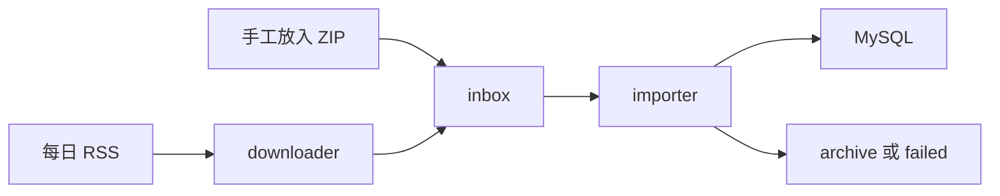

# UDI 医疗器械数据平台

从国家药品监督管理局 RSS 下载 UDI XML ZIP，并把放入 `inbox/` 的完整文件解析到 MySQL。

## 工作方式



- `downloader` 只负责读取 RSS 和下载 ZIP。默认每天下载一次每日文件。
- `importer` 只扫描 `inbox/`，不关心文件来自 RSS、手工上传，还是全量/每周/月度下载。
- 文件写入完成后才改名为 `.zip`；导入器会检查 ZIP 是否可读，完整后自动处理。
- 成功文件移到 `archive/`，解析或导入失败的文件移到 `failed/`。
- 同名文件不会重复下载；同一 `deviceRecordKey` 只允许较新的版本覆盖旧版本。

## 启动

```bash
cp .env.example .env
# 编辑 .env，填写 DB_HOST、DB_NAME、DB_USER、DB_PASSWORD
docker compose up -d --build
docker compose logs -f importer
```

两个服务互不调用：下载器不连接数据库，导入器不请求 RSS。

## 导入全量数据

官方全量 RSS：

<https://udi.nmpa.gov.cn/rss/download.html?files=full>

已有 ZIP 时直接复制到 `inbox/`，无需重启服务：

```bash
cp /path/to/UDID_FULL_RELEASE_*.zip inbox/
```

首次导入测试库，可以重置后单次处理：

```bash
docker compose run --rm importer import-once --reset-db
```

也可以由下载器获取全量文件：

```bash
docker compose run --rm downloader download-once --feed full
```

`--reset-db` 会删除 `.env` 中配置的整个数据库，只用于确认过的测试库。

首次导入 600 万级全量包时，MySQL 8 的默认 `innodb_redo_log_capacity`（通常为 100 MB）可能成为瓶颈。测试库建议先设置为至少 4 GB：

```sql
SET PERSIST innodb_redo_log_capacity = 4294967296;
```

本次全量导入已使用 4 GB 设置完成；如果权限不允许持久化，重启 MySQL 后需要再次设置。

## 其他 RSS

```bash
docker compose run --rm downloader download-once --feed daily
docker compose run --rm downloader download-once --feed weekly
docker compose run --rm downloader download-once --feed monthly
```

- 每日：<https://udi.nmpa.gov.cn/rss/download.html?files=daily>
- 每周：<https://udi.nmpa.gov.cn/rss/download.html?files=weekly>
- 每月：<https://udi.nmpa.gov.cn/rss/download.html?files=monthly>

## 数据库设计

官方 XML 架构表中的业务值全部声明为字符型。项目按字段标题做少量语义化处理：

- UDI、社会信用代码、分类编码、电话、邮箱等保留字符串，避免丢失前导零或特殊表达。
- 数量、公开版本号、纠错次数使用无符号整数。
- 日期和时间增加规范化字段，同时保留 `_raw` 原文。
- 产品描述、MR 信息、特殊储存条件、尺寸说明和纠错说明使用 `TEXT`。
- 包装、储存、临床尺寸、联系人使用独立明细表，`(device_record_key, item_no)` 保留 XML 顺序。

对本地 `UDID_FULL_RELEASE_20260801.zip` 的 1203 个 XML 分片扫描结果：

| 项目 | 记录数/最大字符数 |
| --- | ---: |
| 主记录 | 6,015,000 |
| `cpms` 产品描述 | 1,835 |
| `zczbhhzbapzbh` 注册/备案号 | 844 |
| `correctionRemark` 纠错说明 | 806 |
| `ybbm` 医保编码 | 559 |
| `ggxh` 规格型号 | 437 |
| `deviceRecordKey` | 47 |
| 单条记录最大包装列表 | 102 |
| 单条记录最大临床尺寸列表 | 424 |

官方全量数据中发现少量非法 XML 控制字符，解析器会在流式解析前移除这些字符，并修复裸 `&`；不会对业务字段做截断。

## 目录

```text
src/app.py                 服务入口和模式切换
src/downloader.py         RSS 下载
src/parser.py             XML/ZIP 解析
src/importer.py           批量写入 MySQL
src/file_store.py         inbox、归档、失败文件流转
src/init_db_complete.sql  数据库表结构
inbox/                    待处理 ZIP，也可手工上传
inbox/.processing/        正在处理的 ZIP
archive/                  已处理文件
failed/                   失败文件
```

本地测试：

```bash
PYTHONPATH=src python3 -B -m unittest discover -s tests -v
```
