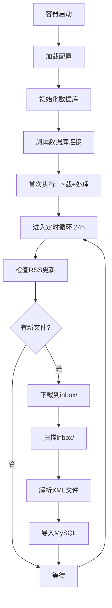

# UDI 医疗器械数据平台

[](https://www.docker.com/)
[](https://www.python.org/)
[](https://www.mysql.com/)
[](LICENSE)

> 自动从国家药品监督管理局(NMPA)下载、解析、存储UDI（医疗器械唯一标识）数据的平台

## ✨ 功能特性

- 🔄 **自动化数据同步**：通过RSS订阅自动下载每日更新数据
- 📦 **全量数据支持**：支持解析UDI全量发布数据（ZIP格式）
- 🗄️ **高性能存储**：MySQL数据库存储，支持600万+记录高效查询
- 🐳 **Docker容器化**：一键部署，长期稳定运行
- ⏰ **定时任务**：每24小时自动检查并处理新数据
- 🔧 **灵活配置**：支持环境变量配置，无硬编码

## 📋 前置要求

- Docker 20.10+
- Docker Compose 2.0+
- MySQL 5.7+ 数据库服务器

## 🚀 快速开始

### 1. 克隆项目

```bash
git clone https://github.com/OnesZhang/udi-data-platform.git
cd udi-data-platform
```

### 2. 配置环境变量

复制并编辑 `.env` 文件：

```bash
cp .env.example .env  # 如果有的话
```

编辑 `.env` 文件，填写数据库配置：

```env
# 数据库配置（必填）
DB_HOST=your-mysql-host
DB_PORT=3306
DB_NAME=udi_devices
DB_USER=your-username
DB_PASSWORD=your-password

# 可选配置
RSS_DAILY_URL=https://udi.nmpa.gov.cn/rss/download.html?files=daily
```

### 3. 启动服务

```bash
# 构建并启动
docker-compose up -d

# 查看日志
docker-compose logs -f

# 查看状态
docker-compose ps
```

### 4. 验证安装

```bash
# 查看应用日志，确认数据库连接成功
docker-compose logs | grep "MySQL连接成功"

# 查看容器状态
docker-compose ps
```

## 📁 项目结构

```
udi-data-platform/
├── 🐳 Docker配置
│   ├── Dockerfile              # Docker镜像构建
│   ├── docker-compose.yml      # Docker编排配置
│   └── .dockerignore           # Docker忽略文件
│
├── 📝 配置文件
│   ├── .env                    # 环境变量配置（需填写）
│   ├── .gitignore              # Git忽略配置
│   └── startup.sh              # 容器启动脚本
│
├── 💻 源代码 (src/)
│   ├── app.py                  # 主应用入口
│   ├── config.py               # 配置管理模块
│   ├── db_initializer.py       # 数据库初始化
│   ├── downloader.py           # RSS下载模块
│   ├── parser_complete.py      # XML解析器
│   ├── importer.py             # 数据导入器
│   ├── utils.py                # 工具函数
│   ├── init_db_complete.sql    # 数据库表结构
│   └── requirements.txt        # Python依赖
│
├── 📂 数据目录
│   ├── inbox/                  # 待处理数据文件入口
│   └── external/               # 项目外资源
│       ├── config/             # RSS配置等
│       ├── docs/               # 文档资料
│       ├── downloads/          # 已下载数据
│       └── legacy/             # 历史数据
│
└── 📄 文档
    └── README.md               # 项目说明
```

## 🗄️ 数据库结构

项目使用MySQL数据库，包含以下核心表：

| 表名 | 描述 | 主要字段 |
|------|------|----------|
| `udi_devices` | 设备主表 | 60个字段，存储设备核心信息 |
| `udi_packing_list` | 包装列表 | 包装层级、规格等 |
| `udi_storage_list` | 储存条件 | 温度、湿度等储存要求 |
| `udi_clinical_list` | 临床尺寸 | 临床使用相关尺寸 |
| `udi_contacts` | 联系人信息 | 企业联系信息 |
| `import_logs` | 导入日志 | 数据导入记录 |

## ⚙️ 配置说明

### 环境变量

| 变量名 | 必填 | 默认值 | 说明 |
|--------|:----:|--------|------|
| `DB_HOST` | ✅ | - | MySQL服务器地址 |
| `DB_PORT` | ✅ | - | MySQL端口号 |
| `DB_NAME` | ✅ | - | 数据库名称 |
| `DB_USER` | ✅ | - | 数据库用户名 |
| `DB_PASSWORD` | ✅ | - | 数据库密码 |
| `RSS_DAILY_URL` | ❌ | 官方RSS | 每日数据RSS地址 |
| `INBOX_DIR` | ❌ | /app/inbox | 数据文件目录 |

## 🔄 工作流程



## 🛠️ 运维命令

```bash
# 启动服务
docker-compose up -d

# 停止服务
docker-compose down

# 重启服务
docker-compose restart

# 查看实时日志
docker-compose logs -f

# 查看最近日志
docker-compose logs --tail 100

# 进入容器
docker-compose exec app bash

# 查看容器状态
docker-compose ps

# 手动触发数据处理（重启容器）
docker-compose restart app
```

## 📦 数据导入

### 自动导入（推荐）

系统会自动通过RSS下载最新数据并处理，无需手动干预。

### 手动导入

将ZIP格式的UDI数据文件放入 `inbox/` 目录：

```bash
cp /path/to/UDID_*.zip inbox/
```

系统会在下一个检查周期自动处理该文件。

## 🔍 故障排查

### 1. 数据库连接失败

检查 `.env` 文件中的数据库配置是否正确：

```bash
docker-compose logs | grep "数据库连接失败"
```

### 2. 下载失败

检查网络连接和RSS地址：

```bash
docker-compose logs | grep "下载失败"
```

### 3. XML解析错误

系统内置三级容错机制，大部分格式问题可自动修复。查看日志获取详情：

```bash
docker-compose logs | grep "解析错误"
```

## 📊 性能指标

- **处理速度**：约 1000条/秒（受硬件影响）
- **存储容量**：支持 600万+ 条记录
- **文件大小**：支持 300MB+ ZIP文件
- **内存占用**：约 500MB-1GB

## 🤝 贡献指南

1. Fork 项目
2. 创建特性分支 (`git checkout -b feature/AmazingFeature`)
3. 提交更改 (`git commit -m 'Add some AmazingFeature'`)
4. 推送到分支 (`git push origin feature/AmazingFeature`)
5. 创建 Pull Request

## 📄 许可证

本项目采用 MIT 许可证 - 查看 [LICENSE](LICENSE) 文件了解详情

## 📧 联系方式

- 项目地址：https://github.com/OnesZhang/udi-data-platform
- Issues：https://github.com/OnesZhang/udi-data-platform/issues

## 🙏 致谢

- [国家药品监督管理局](https://www.nmpa.gov.cn/) - 提供UDI数据
- [Docker](https://www.docker.com/) - 容器化技术
- [Python](https://www.python.org/) - 编程语言
