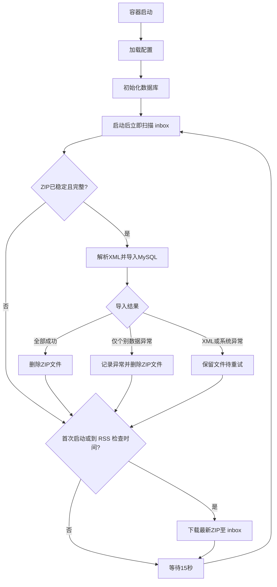

# UDI 医疗器械数据平台

[](https://www.docker.com/)
[](https://www.python.org/)
[](https://www.mysql.com/)
[](LICENSE)

> 自动从国家药品监督管理局(NMPA)下载、解析、存储UDI（医疗器械唯一标识）数据的平台

## ✨ 功能特性

- 🔄 **自动化数据同步**：通过RSS订阅自动下载每日更新数据
- 📦 **全量数据支持**：支持解析UDI全量发布数据及嵌套 ZIP 包
- 🗄️ **MySQL存储**：使用索引支持常用 UDI 字段查询
- 🐳 **Docker容器化**：一键部署，长期稳定运行
- ⏰ **自动处理**：启动后立即检查 RSS，之后每 24 小时检查一次，同时自动处理手动上传到 inbox 的 ZIP 文件
- 🔧 **灵活配置**：支持环境变量配置，无硬编码

## 📋 前置要求

- Docker 20.10+
- Docker Compose 插件 2.0+
- MySQL 5.7+ 数据库服务器
- 容器可访问 MySQL 服务和 NMPA RSS 地址

## 🚀 快速开始

### 1. 克隆项目

```bash
git clone https://github.com/OnesZhang/udi-data-platform.git
cd udi-data-platform
```

### 2. 配置环境变量

复制并编辑 `.env` 文件：

```bash
cp .env.example .env
```

编辑 `.env` 文件，填写数据库配置：

```env
# 数据库配置（必填）
DB_HOST=your-mysql-host
DB_PORT=3306
DB_NAME=udi_devices
DB_USER=your-username
DB_PASSWORD=your-password

# 可选配置
RSS_DAILY_URL=https://udi.nmpa.gov.cn/rss/download.html?files=daily
TZ=Asia/Shanghai
```

首次启动时，程序会自动创建不存在的数据库和全部数据表。数据库账号需具备创建数据库、创建表及数据读写权限。

### 3. 启动服务

```bash
# 构建并启动
docker compose up -d

# 查看日志
docker compose logs -f

# 查看状态
docker compose ps
```

### 4. 验证安装

```bash
# 查看应用日志，确认数据库已初始化
docker compose logs app | grep -E "数据库初始化完成|数据表已存在"

# 查看容器状态
docker compose ps
```

## 📁 项目结构

```
udi-data-platform/
├── 🐳 Docker配置
│   ├── Dockerfile              # Docker镜像构建
│   ├── docker-compose.yml      # Docker编排配置
│   └── .dockerignore           # Docker忽略文件
│
├── 📝 配置文件
│   ├── .env.example            # 环境变量模板
│   ├── .env                    # 本地环境变量配置（自行创建，不提交）
│   ├── .gitignore              # Git忽略配置
│   └── startup.sh              # 容器启动脚本
│
├── 💻 源代码 (src/)
│   ├── app.py                  # 主应用入口
│   ├── config.py               # 配置管理模块
│   ├── db_initializer.py       # 数据库初始化
│   ├── downloader.py           # RSS下载模块
│   ├── inbox_worker.py          # inbox文件稳定性检测与导入调度
│   ├── parser.py               # XML解析器
│   ├── importer.py             # 数据导入器
│   ├── init_db_complete.sql    # 数据库表结构
│   └── requirements.txt        # Python依赖
│
├── 📂 数据目录
│   └── inbox/                  # 待处理数据文件入口
│
├── 🧪 测试 (tests/)
│   ├── test_inbox_worker.py    # inbox处理流程测试
│   └── test_parser.py          # XML解析测试
│
└── 📄 文档
    └── README.md               # 项目说明
```

## 🗄️ 数据库结构

项目使用MySQL数据库，包含以下核心表：

| 表名 | 描述 | 主要字段 |
|------|------|----------|
| `udi_devices` | 设备主表 | 51列，存储设备核心信息 |
| `udi_packing_list` | 包装列表 | 包装层级、规格等 |
| `udi_storage_list` | 储存条件 | 温度、湿度等储存要求 |
| `udi_clinical_list` | 临床尺寸 | 临床使用相关尺寸 |
| `udi_contacts` | 联系人信息 | 企业联系信息 |
| `import_logs` | 导入日志 | 数据导入记录 |
| `import_error_records` | 单条导入错误 | 无法导入的设备记录及字段错误 |

## ⚙️ 配置说明

### 环境变量

| 变量名 | 必填 | 默认值 | 说明 |
|--------|:----:|--------|------|
| `DB_HOST` | ✅ | - | MySQL服务器地址 |
| `DB_PORT` | ✅ | - | MySQL端口号 |
| `DB_NAME` | ✅ | - | 数据库名称 |
| `DB_USER` | ✅ | - | 数据库用户名 |
| `DB_PASSWORD` | ✅ | - | 数据库密码 |
| `RSS_DAILY_URL` | ❌ | 官方RSS | 每日数据RSS地址 |
| `INBOX_DIR` | ❌ | `/app/inbox` | Docker Compose 固定为此路径，并挂载宿主机 `./inbox/` |
| `TZ` | ❌ | `Asia/Shanghai` | 容器日志时区 |

## 🔄 工作流程



## 🛠️ 运维命令

```bash
# 启动服务
docker compose up -d

# 停止服务
docker compose down

# 重启服务
docker compose restart

# 查看实时日志
docker compose logs -f

# 查看最近日志
docker compose logs --tail 100

# 进入容器
docker compose exec app bash

# 查看容器状态
docker compose ps

# 重启服务
docker compose restart app
```

服务配置了 `restart: always`，Docker 或容器重启后会自动恢复运行。

## 📦 数据导入

### 自动导入（推荐）

服务启动后会立即检查一次 RSS，之后每 24 小时检查一次并下载最新数据；下载后的 ZIP 由 inbox 流程自动处理。

### 手动导入

将ZIP格式的UDI数据文件直接放入 `inbox/` 目录：

```bash
cp /path/to/UDID_*.zip inbox/
```

无需重启服务。系统默认每 15 秒检查一次；文件连续 60 秒没有变化且 ZIP 结构完整、所有 XML 记录数校验通过后，才会开始导入。支持 ZIP 内继续嵌套 ZIP（最多 8 层），解析时不会将文件落盘解压。XML 必须为 UTF-8 编码；解析器会在内存中清理 XML 1.0 非法字符和未转义的 `&`。全部导入成功或仅有个别数据字段异常时，文件都会自动删除；字段异常会记录到 `import_error_records`，XML、数据库或系统异常则保留文件并在 60 秒后重试。上传中的文件不会被打断。

## 🔍 故障排查

### 1. 数据库连接失败

检查 `.env` 文件中的数据库配置是否正确：

```bash
docker compose logs app | grep "数据库连接失败"
```

### 2. 下载失败

检查网络连接、RSS 地址和下载链接：

```bash
docker compose logs app | grep -E "RSS 获取失败|下载失败"
```

### 3. XML 解析失败

解析器会在内存中清理 XML 1.0 非法字符和未转义的 `&`；无法解析的文件会保留在 inbox，并在 60 秒后重试。查看日志获取详情：

```bash
docker compose logs app | grep -E "导入异常|XML 解析失败"
```

## 🧪 测试

```bash
python3 -B -m unittest discover -s tests -v
```

## 🤝 贡献指南

1. Fork 项目
2. 创建特性分支 (`git checkout -b feature/AmazingFeature`)
3. 提交更改 (`git commit -m 'Add some AmazingFeature'`)
4. 推送到分支 (`git push origin feature/AmazingFeature`)
5. 创建 Pull Request

## 📄 许可证

本项目采用 MIT 许可证 - 查看 [LICENSE](LICENSE) 文件了解详情

## 📧 联系方式

- 项目地址：https://github.com/OnesZhang/udi-data-platform
- Issues：https://github.com/OnesZhang/udi-data-platform/issues

## 🙏 致谢

- [国家药品监督管理局](https://www.nmpa.gov.cn/) - 提供UDI数据
- [Docker](https://www.docker.com/) - 容器化技术
- [Python](https://www.python.org/) - 编程语言
